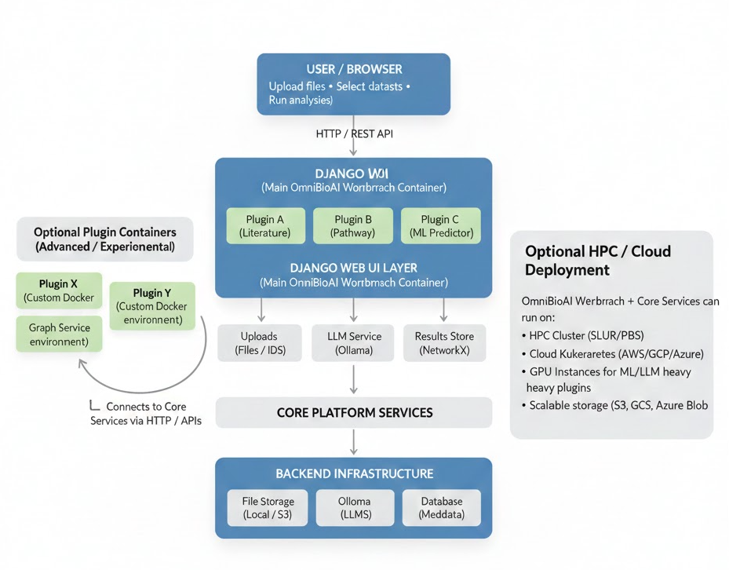

# OmniBioAI

A modular, **AI-powered, plugin-based Django bioinformatics workbench** that integrates tools for genomic data visualization, machine learning prediction, variant annotation, pathway enrichment analysis, literature mining, single-cell analysis, and network analysis.

It features **LLM and RAG-based AI assistance** to provide insights, explanations, and intelligent querying of genomic data.

Additionally, a **Tutorials section** includes script-based example workflows and projects, helping users learn applied AI, ML, and bioinformatics techniques step by step.


---

## Architecture

Here is the architecture of OmniBioAI Workbench:



## Project Structure

```
omnibioai_workbench/
├── manage.py                     # Django management script
├── main_demo.py                  # Standalone demo to test core services
├── db.sqlite3                    # SQLite DB (dev)
├── README.md                     # Project overview & contribution guide
├── requirements.txt
├── Dockerfile
├── start_app.sh

├── data/                         # Centralized data storage
│   ├── uploads/                  # Uploaded user files (VCF, H5, CSV, etc.)
│   ├── results/                  # Analysis outputs
│   ├── reports/                  # Generated PDF/PNG/HTML reports
│   └── logs/                     # Runtime logs

├── static/                       # Static assets (CSS, JS, images)

├── plugins/                      # Plugin-based Django apps (feature modules)
│   ├── home/                     # Landing & dashboard plugin
│   ├── pipeline_manager/         # Workflow & pipeline orchestration
│   ├── ml_predictor/             # ML/DL prediction models
│   ├── variant_annotation/       # Variant annotation (VCF-based)
│   ├── pathway_enrichment/       # GSEA / pathway analysis
│   ├── network_analysis/         # Network & graph analysis plugin
│   ├── literature_summarizer/    # PubMed mining & summarization
│   ├── single_cell_analysis/     # scRNA-seq analysis & visualization
│   ├── gene_annotation/          # Gene & functional annotation
│   └── plugin_template/          # Reference template for contributors

├── omnibioai/                    # Core Django project
│   ├── __init__.py
│   ├── settings.py
│   ├── urls.py
│   ├── asgi.py
│   ├── wsgi.py

│   ├── core/                     # ✅ Core platform layer (framework-agnostic)
│   │   ├── __init__.py
│   │   ├── config.py             # Global configuration & env variables
│   │   ├── exceptions.py         # Custom exception hierarchy
│   │   └── constants.py          # Shared constants

│   ├── services/                 # ✅ Reusable core services
│   │   ├── __init__.py
│   │   ├── agentic_ai_service.py        # Agentic AI orchestration & autonomous workflows
│   │   ├── auth_service.py              # Authentication & JWT/OAuth hooks
│   │   ├── experiment_tracking_service.py # ML/analysis experiment tracking
│   │   ├── igv_service/                 # IGV genome browser service
│   │   │   ├── __init__.py
│   │   │   ├── igv_service.py           # Core IGV API integration
│   │   │   ├── session_builder.py       # Session construction & configuration
│   │   │   └── track_registry.py        # Track management & registry
│   │   ├── llm_service.py               # LLM integration (Ollama, LLaMA3, DeepSeek)
│   │   ├── logger_service.py            # Centralized logging & log formatting
│   │   ├── model_zoo_service.py         # ML/DL model registry & loader
│   │   ├── network_viz.py               # Network/graph visualizations (PyVis/NetworkX)
│   │   ├── permissions.py               # RBAC & permission management
│   │   ├── rag_service.py               # RAG orchestration (ragbio integration)
│   │   ├── reporting_service.py         # Tables, plots, PDF/PNG report generation
│   │   ├── upload_service.py            # File upload & validation (VCF, H5, CSV)
│   │   └── user_models.py               # User & role abstractions

│   ├── integrations/             # External systems
│   │   ├── ragbio/               # ✅ RAG-powered gene discovery package
│   │   ├── neo4j/                # Knowledge graph integration
│   │   └── igv/                  # IGV & genome browser hooks

│   └── utils/                    # Shared utilities
│       ├── validators.py         # Input validation (VCF/H5/CSV)
│       ├── file_utils.py
│       └── date_utils.py

```

---

## Getting Started

### 1. Clone the Repository

```bash
git clone https://github.com/your-username/omnibioai_project.git
cd omnibioai_project
```

### 2. Set Up Virtual Environment

```bash
python3 -m venv env
source env/bin/activate
```

### 3. Install Dependencies

```bash
pip install -r requirements.txt
```

> If `requirements.txt` is missing, install core dependencies manually:

```bash
pip install django gseapy pandas
```

### 4. Run Migrations

```bash
python manage.py migrate
```

### 5. Start the Server

```bash
./start_app.sh
# or
python manage.py runserver
```

Visit [http://127.0.0.1:8000](http://127.0.0.1:8000) to access the workbench.

---

## Plugins Overview

| Plugin                   | Description                                                                                  |
| ------------------------ | -------------------------------------------------------------------------------------------- |
| `home/`                  | Landing page with general info about OmniBioAI                                               |
| `igv_viewer/`            | Visualize genomic tracks via IGV.js                                                          |
| `pipeline_manager/`      | Launch and monitor bioinformatics pipelines                                                  |
| `ml_predictor/`          | Apply machine learning models to biological datasets                                         |
| `variant_annotation/`    | Annotate VCF or variant files using bioinformatics tools                                     |
| `pathway_enrichment/`    | Run Enrichr or GSEA on gene lists and visualize results                                      |
| `network_analysis/`      | Analyze and visualize keyword co-occurrence networks from literature                         |
| `literature_summarizer/` | Summarize, extract entities, and analyze trends from biomedical literature using LLMs        |
| `single_cell_analysis/`  | Single-cell RNA-seq data processing and visualization                                        |
| `gene_annotation/`       | Functional annotation of genes and variants leveraging LLMs                                  |
| `ollama-server/`         | Backend API for Ollama LLM integration                                                       |
| `bio_navigator/`         | Interactive genomic data query and analysis using Hugging Face-powered AI                    |
| `data_uploader/`         | Upload and process biological datasets for various plugins, including FAISS indexing for RAG |
| `rag_inference/`         | Retrieval-Augmented Generation (RAG) for querying biological documents                       |

---

## Pathway Enrichment Input Formats

* **Enrichr**: `.tsv` file with **one gene per line**
* **GSEA**: `.tsv` file with **two columns**: `gene` and `score`

---

## Utilities

* `start_app.sh`: Launch the Django application
* `data/`: Temporary directory for uploaded and processed files

---

## Docker Usage

### Build Docker Image

```bash
docker build -t omnibioai:latest .
```

### Run Docker Container

```bash
docker run -d -p 8000:8000 omnibioai:latest
```

* `-d`: Run container in background
* `-p 8000:8000`: Map local port 8000 to container port 8000

Visit [http://localhost:8000](http://localhost:8000)

---

## Kubernetes Deployment (Optional)

You can deploy OmniBioAI and Ollama Server using Kubernetes for scalable, production-ready setups.

### Steps:

1. Create namespace:

```bash
kubectl create namespace omnibioai
```

2. Apply manifests:

```bash
kubectl apply -f K8s/omnibioai-deployment.yaml
kubectl apply -f K8s/omnibioai-service.yaml
kubectl apply -f K8s/ollama-deployment.yaml
kubectl apply -f K8s/ollama-service.yaml
```

3. Access services:

* OmniBioAI: `http://localhost:30080` (NodePort example)
* Ollama Server: `http://localhost:31434`

For Minikube:

```bash
minikube service omnibioai-service -n omnibioai
minikube service ollama-service -n omnibioai
```

---